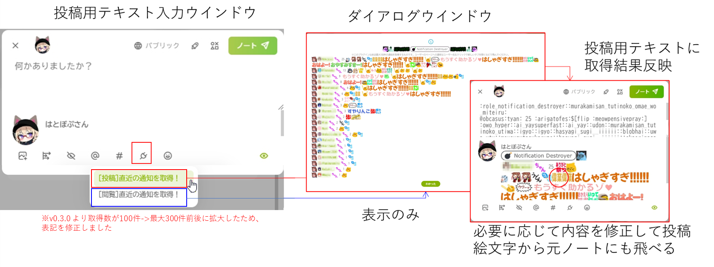

# misskey-destroyer-watch-plugin
直近の通知破壊者のリアクションを一覧で見るMisskeyプラグインです。



## 使い方

投稿用テキスト入力画面のプラグインボタンから選択し、リアクションを通知を取得します。  
[閲覧] ボタンを押すとダイアログウインドウの表示のみを行います。  
[投稿] ボタンを押すとダイアログウインドウの表示後、投稿用テキストに結果の反映をします。  

## 導入

releaseからMisskeyDestroyerWatchPlugin.isをダウンロードし、内容を全てコピーし、`設定 > プラグインのインストール`のテキストエリアに貼付、`インストール`を押してください。  
<small>※コピーに不備がある場合はインストールに失敗しエラーが表示されると思います。</small>


通知を見るreleaseからMisskeyDestroyerWatchPlugin.isをダウンロードし、内容を全てコピーし、`設定 > プラグインのインストール`のテキストエリアに貼付、`インストール`を押してください。  
<small>※コピーに不備がある場合はインストールに失敗しエラーが表示されると思います。</small>


###  ダイアログの表示修正用custom css
max-widthとtext-alignを以下のように修正して適応(数値は調整してください)
```css
.xa5A4 {
    min-width: 320px;
    max-width: 2000px;  /* original 480px; */
    box-sizing: border-box;
    text-align: left; /* original center; */
}
```

## 設定値の変更
設定 > プラグイン > 設定ボタンからパラメータの変更画面に遷移します。


### 共通パラメータ
共通のパラメータです。  


### ダイアログのパラメータ
共通のパラメータです。  


### 投稿用テキストのパラメータ
投稿用テキストのパラメータです。


## 作者
@hatopop_vr@misskey.io