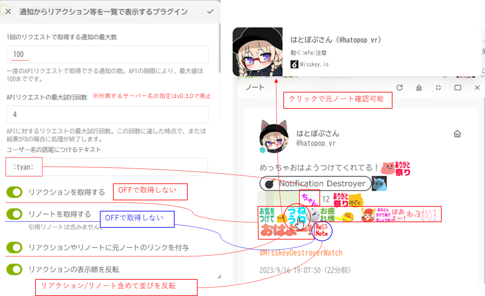

# misskey-destroyer-watch-plugin
直近の通知破壊者のリアクションを一覧で見るMisskeyプラグインです。[AiScript](https://github.com/syuilo/aiscript/tree/master)によって記述されています。


## 使い方

- 投稿用テキスト入力画面のプラグインボタンから選択し、リアクションを通知を取得します。
- `[閲覧]` ボタンを押すとダイアログウインドウの表示のみを行います。
- `[投稿]` ボタンを押すとダイアログウインドウの表示後、投稿用テキストに結果の反映をします。

## 導入

1. [`release`](https://github.com/hatopopvr/misskey-destroyer-watch-plugin/releases)から`MisskeyDestroyerWatchPlugin.is`をダウンロードします。
2. ダウンロードした内容を全てコピーします。
3. Misskeyの`設定 > プラグインのインストール`のテキストエリアに貼付けます。
4. `インストール`ボタンを押します。

<small>※コピーに不備がある場合はインストールに失敗しエラーが表示されると思います。</small>


5. `通知を見る`がONになっているのを確認し、右上のチェックボタンを押してください。


###  カスタムCSSでのダイアログの表示修正
max-widthとtext-alignを以下のように修正して適用してください(数値は調整可能)。
```css
.xa5A4 {
    min-width: 320px;
    max-width: 2000px;  /* original 480px; */
    box-sizing: border-box;
    text-align: left; /* original center; */
}
```

## 設定値の変更
1. `設定 > プラグイン`に移動します。
2. `設定`ボタンをクリックして、パラメータの変更画面に進みます。


### 共通パラメータ


### ダイアログのパラメータ


### 投稿用テキストのパラメータ


## 作者
[hatopop_vr](https://misskey.io/@hatopop_vr)
